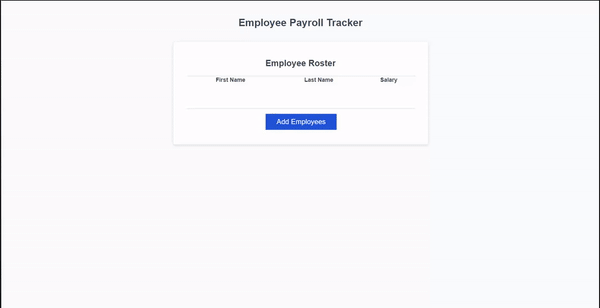

# Employee-Payroll-Tracker

## Description

We decided to create this application because we thought it would be a convenient thing for people to have and use. This app allowed us to let people enter employee data in a lightweight and easy to access page that has the ability to store data entered and display it for people to use. The app allows you to enter as many empoyees as you want into the table with the app automatically adding new rows for more employees. The app also allows the average of all employee salary to be posted to the console and it will change when updated with more information.

## Usage

To use the app simply load up the code in a browser and you will be presented with a bland table and a button that reads "Add Employees". Click on this button and you will be prompted to enter your info and will be asked at the end of your entry if you'd like to add another one. If you press cancel info entry will end and your data will be updated on the page, but you can add more by pressing the button again or pressing confirm when asked to continue. If you open up the console you will be presented with some additional info including a copy of your data table, an average of your employee salaries, and a randomly selected employee as a sample.

Feel free to try out the app here: https://xydra01.github.io/Week-3-Employee-Payroll-Tracker/

## License

Refer to LICENSE.MD

---
